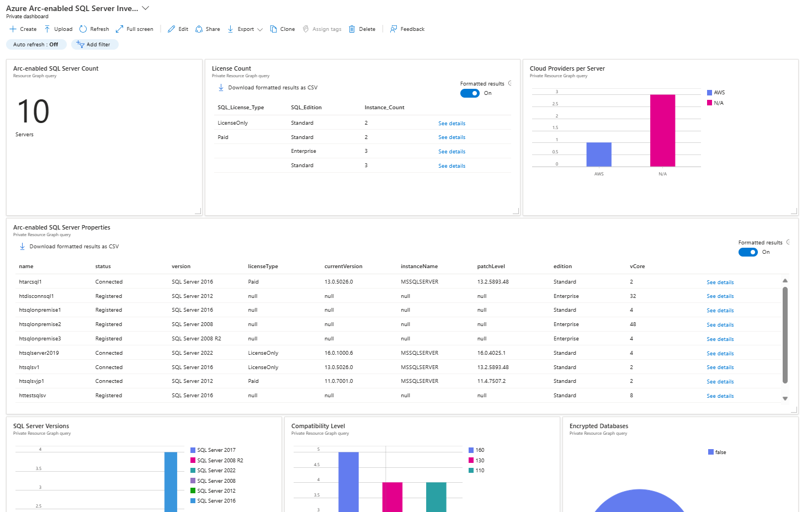

# Sample dashboard for Azure Arc-enabled SQL Server

This sample dashboard enables you to easily manage your Azure Arc-enabled SQL Server inventory.

It includes:

- Number of SQL Servers
- License Type
- Cloud Providers per server
- Detailed inventory
- SQL Server versions
- Compatibility Levels
- Number of encrypted databases

## How to install the dashboard

1. Go to https://portal.azure.com
2. Ensure that you can access to the subscription that has Azure Arc-enabled SQL Server
3. Go to dashboard, click "Upload", select "azure-arc-enabled-sql-dashboard.json"

